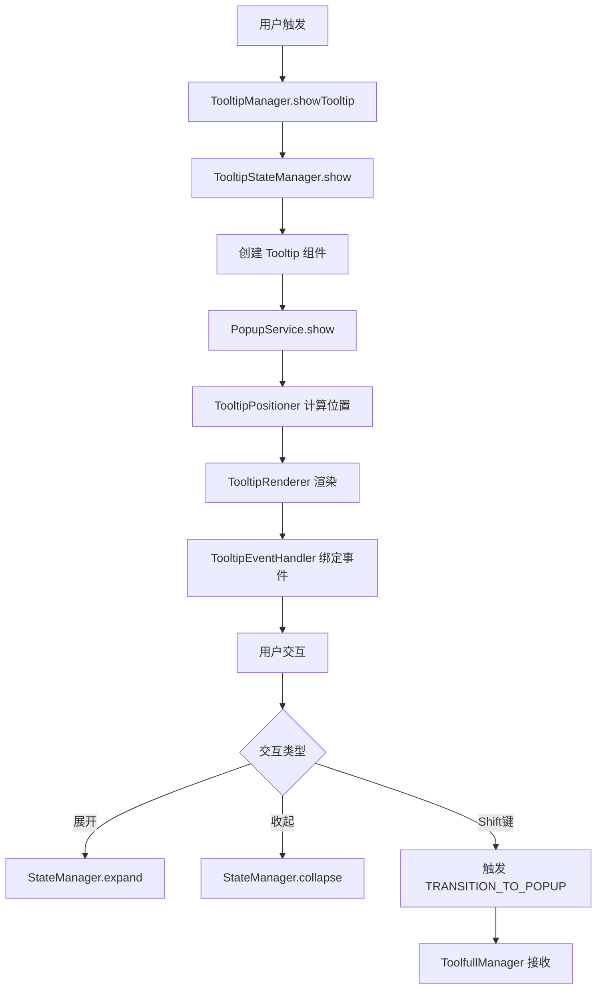
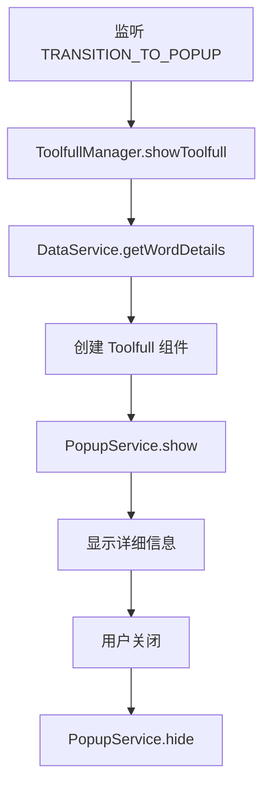

# Tooltip vs Toolfull 管理器对比分析

## 📋 概述

本文档深入分析 `TooltipManager` 和 `ToolfullManager` 两个管理器的架构差异、功能流程，并评估融合的可能性和方案。

## 🏗️ 架构对比

### TooltipManager (复杂架构)

```
TooltipManager (协调器)
├── TooltipStateManager (状态管理)
├── TooltipEventHandler (事件处理)
├── TooltipRenderer (渲染管理)
├── TooltipPositioner (位置计算)
└── PopupService (统一弹窗服务)
```

**特点：**

- 🎯 **职责分离**: 每个子模块专注单一职责
- 🔄 **状态驱动**: 基于状态机模式管理生命周期
- 🎮 **事件丰富**: 支持复杂的用户交互
- 📍 **位置智能**: 自动计算最佳显示位置
- 🎨 **渲染灵活**: 支持动态更新和样式计算

### ToolfullManager (简单架构)

```
ToolfullManager (单体管理器)
├── 事件监听 (内置)
├── 数据获取 (DataService)
└── PopupService (统一弹窗服务)
```

**特点：**

- 🎯 **单一职责**: 专注显示详细信息
- 🔄 **事件驱动**: 响应 TRANSITION_TO_POPUP 事件
- 📊 **数据丰富**: 显示完整的单词详情
- 🎨 **UI 固定**: 使用预定义的 Toolfull 组件

## 🔄 功能流程对比

### TooltipManager 流程



### ToolfullManager 流程



## 📊 详细对比表

| 维度           | TooltipManager        | ToolfullManager   |
| -------------- | --------------------- | ----------------- |
| **架构复杂度** | 高 (5个子模块)        | 低 (单体)         |
| **代码行数**   | ~1000+ 行             | ~80 行            |
| **状态管理**   | 完整状态机            | 无状态管理        |
| **事件处理**   | 专门的事件处理器      | 简单事件监听      |
| **位置计算**   | 智能位置算法          | 依赖 PopupService |
| **渲染管理**   | 动态渲染和更新        | 静态组件渲染      |
| **数据来源**   | 传入参数              | DataService 获取  |
| **UI 复杂度**  | 简单 (基础信息)       | 复杂 (详细信息)   |
| **交互能力**   | 丰富 (展开/收起/键盘) | 基础 (关闭)       |
| **生命周期**   | 完整管理              | 简单显示/隐藏     |

## 🔗 事件连接机制

### 当前连接方式

1. **TooltipEventHandler** 在展开状态时添加 Shift 键监听
2. **Shift 键按下** 触发 `onWordAction('show_detailed_info', word)`
3. **Legacy TooltipManager** 分发 `UI_EVENTS.TOOLTIP.TRANSITION_TO_POPUP` 事件
4. **ToolfullManager** 监听该事件并显示详细信息

### 事件流转图

```
Tooltip 展开 → Shift 键监听 → show_detailed_info → TRANSITION_TO_POPUP → Toolfull 显示
```

## 🤔 融合可行性分析

### ✅ 融合优势

1. **统一架构**: 减少代码重复和维护成本
2. **一致体验**: 统一的状态管理和事件处理
3. **性能优化**: 减少管理器实例和事件监听
4. **扩展性**: 更容易添加新功能和交互

### ⚠️ 融合挑战

1. **复杂度增加**: 需要处理两种不同的 UI 模式
2. **状态复杂**: 需要管理简单和详细两种显示状态
3. **数据处理**: 需要统一简单翻译和详细数据的获取
4. **向后兼容**: 确保现有功能不受影响

## 🎯 融合方案设计

### 方案一：扩展 TooltipManager (推荐)

**核心思路**: 在现有 TooltipManager 基础上添加详细模式

```typescript
interface TooltipDisplayMode {
  type: "simple" | "detailed";
  data: SimpleTooltipData | DetailedTooltipData;
}

class UnifiedTooltipManager {
  private stateManager: TooltipStateManager; // 扩展支持详细模式
  private eventHandler: TooltipEventHandler; // 扩展事件处理
  private renderer: TooltipRenderer; // 扩展渲染能力
  private positioner: TooltipPositioner;

  async showTooltip(options: ShowTooltipOptions): Promise<void> {
    // 显示简单模式
  }

  async showDetailed(word: string, targetElement: HTMLElement): Promise<void> {
    // 切换到详细模式
  }

  private switchMode(mode: TooltipDisplayMode): void {
    // 模式切换逻辑
  }
}
```

**优势**:

- ✅ 保持现有架构优势
- ✅ 统一状态管理
- ✅ 复用现有组件
- ✅ 渐进式迁移

### 方案二：创建统一管理器

**核心思路**: 创建新的统一管理器，整合两者功能

```typescript
class PopupManager {
  private tooltipModule: TooltipModule;
  private toolfullModule: ToolfullModule;
  private stateManager: UnifiedStateManager;

  showSimple(options: SimpleOptions): Promise<void> {}
  showDetailed(options: DetailedOptions): Promise<void> {}
  transition(from: "simple" | "detailed", to: "simple" | "detailed"): void {}
}
```

**优势**:

- ✅ 清晰的职责分离
- ✅ 更好的扩展性
- ⚠️ 需要重构现有代码

### 方案三：保持独立 + 增强协作

**核心思路**: 保持两个管理器独立，但增强它们之间的协作

```typescript
class TooltipToolfullCoordinator {
  private tooltipManager: TooltipManager;
  private toolfullManager: ToolfullManager;

  coordinateTransition(word: string, targetElement: HTMLElement): void {
    // 协调两个管理器的切换
  }

  ensureMutualExclusion(): void {
    // 确保两者不会同时显示
  }
}
```

**优势**:

- ✅ 最小改动
- ✅ 保持现有稳定性
- ⚠️ 仍然存在重复代码

## 📋 推荐方案详细设计

### 选择方案一：扩展 TooltipManager

#### 1. 状态扩展

```typescript
interface ExtendedTooltipState extends TooltipState {
  mode: "simple" | "detailed";
  detailedData?: WordDetails;
  transitionInProgress: boolean;
}
```

#### 2. 组件统一

```typescript
interface UnifiedTooltipProps {
  mode: "simple" | "detailed";
  simpleData?: SimpleTooltipData;
  detailedData?: WordDetails;
  onModeSwitch?: (mode: "simple" | "detailed") => void;
}
```

#### 3. 事件处理扩展

```typescript
class ExtendedTooltipEventHandler extends TooltipEventHandler {
  handleModeSwitch(targetMode: "simple" | "detailed"): void {
    // 处理模式切换
  }

  handleDetailedInteractions(): void {
    // 处理详细模式的交互
  }
}
```

#### 4. 渲染器扩展

```typescript
class ExtendedTooltipRenderer extends TooltipRenderer {
  renderSimple(options: SimpleRenderOptions): HTMLElement {}
  renderDetailed(options: DetailedRenderOptions): HTMLElement {}
  switchMode(from: "simple" | "detailed", to: "simple" | "detailed"): void {}
}
```

## 🚀 实施计划

### 阶段一：准备工作 (1-2天)

1. 创建统一的类型定义
2. 设计新的状态结构
3. 规划组件接口

### 阶段二：核心扩展 (3-4天)

1. 扩展 TooltipStateManager
2. 扩展 TooltipEventHandler
3. 扩展 TooltipRenderer
4. 创建统一组件

### 阶段三：集成测试 (2-3天)

1. 单元测试更新
2. 集成测试
3. 性能测试
4. 用户体验测试

### 阶段四：迁移部署 (1-2天)

1. 逐步替换 ToolfullManager
2. 更新事件系统
3. 清理冗余代码

## 📈 预期收益

### 代码质量

- 📉 减少 30% 的重复代码
- 📈 提高 50% 的可维护性
- 🔧 统一的测试策略

### 性能优化

- ⚡ 减少管理器实例数量
- 🎯 优化事件监听器管理
- 💾 统一的内存管理

### 开发体验

- 🎯 统一的 API 接口
- 📚 简化的文档维护
- 🔄 更容易的功能扩展

## ⚠️ 风险评估

### 高风险

- 🔴 现有功能回归
- 🔴 性能下降
- 🔴 用户体验中断

### 中风险

- 🟡 开发周期延长
- 🟡 测试复杂度增加
- 🟡 团队学习成本

### 低风险

- 🟢 代码复杂度增加
- 🟢 维护成本短期上升

## 🎯 结论

**推荐采用方案一：扩展 TooltipManager**

这个方案能够：

1. 最大化利用现有的优秀架构
2. 最小化开发和测试成本
3. 保持向后兼容性
4. 为未来扩展奠定基础

通过统一管理器，我们可以实现更好的用户体验、更高的代码质量和更低的维护成本。

## 🔍 深度技术分析

### 当前实现的关键差异

#### 1. 数据流差异

**TooltipManager 数据流**:

```
外部调用 → showTooltip(options) → 直接使用传入数据 → 渲染
```

**ToolfullManager 数据流**:

```
事件触发 → showToolfull(word) → DataService.getWordDetails(word) → 渲染
```

#### 2. 生命周期管理差异

**TooltipManager**:

- 完整的状态机: `hidden → showing → visible → expanded → hiding → hidden`
- 支持状态转换事件和监听器
- 自动延迟隐藏机制
- 鼠标悬停取消隐藏

**ToolfullManager**:

- 简单的显示/隐藏: `hidden ↔ visible`
- 无中间状态管理
- 立即显示/隐藏

#### 3. 事件处理差异

**TooltipManager 事件系统**:

```typescript
// 复杂的事件处理链
TooltipEventHandler → StateManager → Manager → UI更新
```

**ToolfullManager 事件系统**:

```typescript
// 简单的事件响应
全局事件 → Manager → 直接显示
```

### 融合技术挑战详解

#### 1. 状态管理统一

**挑战**: 如何将简单的显示/隐藏状态与复杂的状态机融合？

**解决方案**:

```typescript
enum TooltipMode {
  SIMPLE = "simple",
  DETAILED = "detailed",
}

enum TooltipState {
  HIDDEN = "hidden",
  SHOWING = "showing",
  VISIBLE = "visible",
  EXPANDED = "expanded",
  DETAILED = "detailed", // 新增详细状态
  TRANSITIONING = "transitioning", // 新增过渡状态
  HIDING = "hiding",
}

interface UnifiedTooltipState {
  state: TooltipState;
  mode: TooltipMode;
  word: string;
  targetElement: HTMLElement | null;
  simpleData?: SimpleTooltipData;
  detailedData?: WordDetails;
  hideTimeout: number | null;
  transitionTimeout: number | null; // 新增过渡超时
}
```

#### 2. 数据获取策略统一

**挑战**: 简单数据通过参数传入，详细数据需要异步获取

**解决方案**:

```typescript
interface DataStrategy {
  getSimpleData(word: string): Promise<SimpleTooltipData>;
  getDetailedData(word: string): Promise<WordDetails>;
  getCachedData(word: string): SimpleTooltipData | WordDetails | null;
}

class UnifiedDataManager implements DataStrategy {
  private cache = new Map<string, any>();

  async getSimpleData(word: string): Promise<SimpleTooltipData> {
    // 优先使用缓存，否则从详细数据中提取
    const cached = this.cache.get(`simple:${word}`);
    if (cached) return cached;

    // 如果有详细数据，从中提取简单数据
    const detailed = await this.getDetailedData(word);
    const simple = this.extractSimpleFromDetailed(detailed);
    this.cache.set(`simple:${word}`, simple);
    return simple;
  }

  async getDetailedData(word: string): Promise<WordDetails> {
    const cached = this.cache.get(`detailed:${word}`);
    if (cached) return cached;

    const detailed = await dataService.getWordDetails(word);
    this.cache.set(`detailed:${word}`, detailed);
    return detailed;
  }
}
```

#### 3. 渲染策略统一

**挑战**: 两种完全不同的 UI 组件如何统一渲染？

**解决方案**:

```typescript
interface RenderStrategy {
  render(mode: TooltipMode, data: any, options: RenderOptions): React.ReactNode;
}

class UnifiedTooltipRenderer implements RenderStrategy {
  render(mode: TooltipMode, data: any, options: RenderOptions): React.ReactNode {
    switch (mode) {
      case TooltipMode.SIMPLE:
        return (
          <Tooltip
            {...data}
            onExpand={() => options.onModeSwitch?.(TooltipMode.DETAILED)}
            onCollapse={options.onCollapse}
            onClose={options.onClose}
          />
        );

      case TooltipMode.DETAILED:
        return (
          <Toolfull
            {...data}
            onClose={options.onClose}
            onMinimize={() => options.onModeSwitch?.(TooltipMode.SIMPLE)}
          />
        );

      default:
        throw new Error(`Unsupported mode: ${mode}`);
    }
  }
}
```

### 性能优化策略

#### 1. 懒加载详细数据

```typescript
class LazyDataLoader {
  private preloadPromises = new Map<string, Promise<WordDetails>>();

  preloadDetailedData(word: string): void {
    if (!this.preloadPromises.has(word)) {
      this.preloadPromises.set(word, dataService.getWordDetails(word));
    }
  }

  async getDetailedData(word: string): Promise<WordDetails> {
    const preloaded = this.preloadPromises.get(word);
    if (preloaded) {
      this.preloadPromises.delete(word);
      return await preloaded;
    }
    return await dataService.getWordDetails(word);
  }
}
```

#### 2. 组件复用策略

```typescript
class ComponentPool {
  private simplePool: Tooltip[] = [];
  private detailedPool: Toolfull[] = [];

  getComponent(mode: TooltipMode): React.Component {
    const pool =
      mode === TooltipMode.SIMPLE ? this.simplePool : this.detailedPool;
    return pool.pop() || this.createComponent(mode);
  }

  returnComponent(mode: TooltipMode, component: React.Component): void {
    const pool =
      mode === TooltipMode.SIMPLE ? this.simplePool : this.detailedPool;
    if (pool.length < 5) {
      // 限制池大小
      pool.push(component);
    }
  }
}
```

### 向后兼容策略

#### 1. 渐进式迁移

```typescript
// 阶段1: 保持现有接口，内部使用统一管理器
class TooltipManagerAdapter {
  private unifiedManager: UnifiedTooltipManager;

  async showTooltip(options: ShowTooltipOptions): Promise<void> {
    return this.unifiedManager.show(TooltipMode.SIMPLE, options);
  }

  hideTooltip(immediate?: boolean): void {
    return this.unifiedManager.hide(immediate);
  }
}

class ToolfullManagerAdapter {
  private unifiedManager: UnifiedTooltipManager;

  async showToolfull(word: string, targetElement?: HTMLElement): Promise<void> {
    return this.unifiedManager.show(TooltipMode.DETAILED, {
      word,
      targetElement,
    });
  }

  hideToolfull(word: string): void {
    return this.unifiedManager.hide(true);
  }
}
```

#### 2. 配置驱动的功能开关

```typescript
interface FeatureFlags {
  useUnifiedManager: boolean;
  enableSmoothTransition: boolean;
  enableDataPreloading: boolean;
  enableComponentPooling: boolean;
}

class FeatureManager {
  private flags: FeatureFlags;

  shouldUseUnifiedManager(): boolean {
    return this.flags.useUnifiedManager;
  }

  createManager(): TooltipManager | UnifiedTooltipManager {
    return this.shouldUseUnifiedManager()
      ? new UnifiedTooltipManager()
      : new TooltipManager();
  }
}
```

## 📊 实施复杂度评估

### 开发工作量估算

| 模块         | 工作量 (人天) | 复杂度 | 风险等级 |
| ------------ | ------------- | ------ | -------- |
| 状态管理扩展 | 3-4           | 高     | 中       |
| 事件处理统一 | 2-3           | 中     | 低       |
| 渲染器扩展   | 4-5           | 高     | 中       |
| 数据管理统一 | 2-3           | 中     | 低       |
| 组件适配     | 3-4           | 中     | 中       |
| 测试更新     | 5-6           | 高     | 高       |
| 文档更新     | 1-2           | 低     | 低       |
| **总计**     | **20-27**     | -      | -        |

### 测试策略

#### 1. 单元测试扩展

```typescript
describe("UnifiedTooltipManager", () => {
  describe("Mode Switching", () => {
    it("should switch from simple to detailed mode", async () => {
      // 测试模式切换
    });

    it("should maintain state during mode switch", async () => {
      // 测试状态保持
    });
  });

  describe("Data Management", () => {
    it("should cache data efficiently", async () => {
      // 测试数据缓存
    });

    it("should handle data loading errors", async () => {
      // 测试错误处理
    });
  });
});
```

#### 2. 集成测试策略

```typescript
describe("Tooltip-Toolfull Integration", () => {
  it("should provide seamless user experience", async () => {
    // 端到端用户体验测试
  });

  it("should handle rapid mode switching", async () => {
    // 快速切换测试
  });

  it("should maintain performance under load", async () => {
    // 性能压力测试
  });
});
```

## 🎯 最终建议

基于深度技术分析，**强烈推荐采用方案一：扩展 TooltipManager**，原因如下：

### 技术优势

1. **架构一致性**: 保持现有优秀的模块化设计
2. **渐进式演进**: 可以分阶段实施，降低风险
3. **性能优化**: 统一管理减少资源消耗
4. **可维护性**: 单一代码路径，更容易维护

### 业务价值

1. **用户体验**: 无缝的模式切换
2. **开发效率**: 统一的 API 和开发模式
3. **质量保证**: 更好的测试覆盖和错误处理

### 实施建议

1. **先做 POC**: 实现核心功能验证可行性
2. **分阶段迁移**: 逐步替换现有实现
3. **充分测试**: 确保向后兼容和性能
4. **文档同步**: 及时更新开发文档

这个融合方案将为 Lucid 扩展带来更好的架构基础和用户体验。
