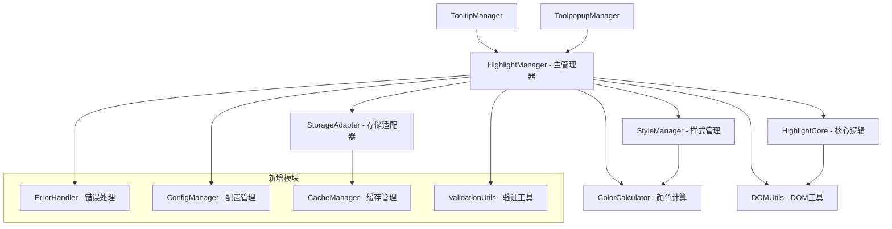
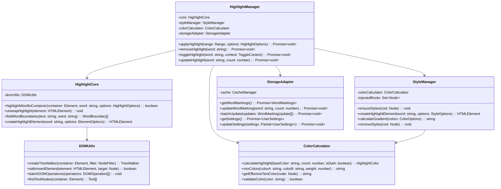

# highlightUtils.ts 全面优化分析与重构计划

## 📋 项目概述

本文档详细分析了 `src/utils/highlight/highlightUtils.ts` 文件中存在的问题，并提供了全面的优化重构方案。该文件是浏览器扩展高亮功能的核心模块，当前存在严重的架构和代码质量问题。

## 🔍 当前问题分析

### 1. 架构问题（严重）

#### 1.1 单一文件过大
- **问题**：1760行代码集中在单个文件中
- **影响**：违反单一职责原则，难以维护和测试
- **具体表现**：
  - 高亮逻辑、样式管理、DOM操作、存储管理混在一起
  - 函数职责不清晰，相互依赖复杂
  - 新功能开发困难，容易引入bug

#### 1.2 职责混乱
- **问题**：多种不同类型的功能混合在一起
- **具体表现**：
  ```typescript
  // 样式管理 + DOM操作 + 存储访问 + 颜色计算都在同一个文件
  const StyleManager = { /* 样式管理 */ };
  function highlightWordInContainer() { /* DOM操作 */ }
  function calculateHighlight() { /* 颜色计算 */ }
  async function applyWordHighlight() { /* 存储访问 */ }
  ```

#### 1.3 重复代码
- **问题**：存储访问逻辑在多处重复
- **具体表现**：
  ```typescript
  // 在多个函数中重复出现
  const data: ExtensionStorage = (await browser.storage.local.get([
    "wordMarkings",
  ])) as ExtensionStorage;
  ```

#### 1.4 紧耦合
- **问题**：直接依赖 `browser.storage`，难以测试
- **影响**：无法进行单元测试，难以模拟不同环境

### 2. 性能问题（严重）

#### 2.1 频繁DOM操作
- **问题**：每次高亮都进行大量DOM遍历
- **具体表现**：
  ```typescript
  // 每次都创建新的TreeWalker，没有缓存机制
  const walker = document.createTreeWalker(container, NodeFilter.SHOW_TEXT);
  ```
- **影响**：页面性能下降，用户体验差

#### 2.2 重复存储访问
- **问题**：多个函数重复调用 `browser.storage.local.get`
- **影响**：不必要的异步操作，增加延迟

#### 2.3 内存泄漏风险
- **问题**：事件监听器管理不当
- **具体表现**：
  ```typescript
  // 可能存在内存泄漏
  element.addEventListener('mouseenter', async () => { /* ... */ });
  ```

#### 2.4 样式重复注入
- **问题**：`StyleManager.ensureStyles()` 可能重复注入相同样式
- **影响**：DOM节点增加，内存占用上升

### 3. 代码质量问题（中等）

#### 3.1 错误处理不一致
- **问题**：有些地方有 try-catch，有些没有
- **具体表现**：
  ```typescript
  // 有些函数有错误处理
  try {
    await browser.storage.local.set({ wordMarkings });
  } catch (error) {
    console.error('[Lucid] Error:', error);
  }
  
  // 有些函数没有错误处理
  const data = await browser.storage.local.get(['wordMarkings']);
  ```

#### 3.2 类型安全问题
- **问题**：大量类型断言和可选链
- **具体表现**：
  ```typescript
  const data: ExtensionStorage = (await browser.storage.local.get([
    "wordMarkings",
  ])) as ExtensionStorage; // 强制类型断言
  ```

#### 3.3 硬编码常量
- **问题**：魔法数字和字符串散布在代码中
- **具体表现**：
  ```typescript
  const MAX_MARK_COUNT = 10; // 硬编码在文件中
  const LEVEL_STEP = 2;
  const DEFAULT_BASE_COLOR = "orange";
  ```

#### 3.4 调试代码残留
- **问题**：大量 console.log 语句
- **影响**：生产环境性能影响，代码可读性差

### 4. 安全问题（中等）

#### 4.1 XSS风险
- **问题**：直接操作 innerHTML 而不进行转义
- **具体表现**：
  ```typescript
  el.textContent = word; // 相对安全
  // 但在其他地方可能存在innerHTML使用
  ```

#### 4.2 存储数据验证缺失
- **问题**：没有验证从存储中读取的数据格式
- **风险**：恶意数据可能导致程序异常

## 🏗️ 重构架构设计

### 新的模块结构



### 类图设计



## 📝 详细实施计划

### 阶段一：架构重构（优先级：高）

#### 1.1 模块拆分

**创建核心模块文件：**

1. **`src/utils/highlight/core/HighlightCore.ts`** - 核心高亮逻辑
2. **`src/utils/highlight/styles/StyleManager.ts`** - 样式管理
3. **`src/utils/highlight/utils/ColorCalculator.ts`** - 颜色计算
4. **`src/utils/highlight/storage/StorageAdapter.ts`** - 存储适配器
5. **`src/utils/highlight/utils/DOMUtils.ts`** - DOM操作工具

#### 1.2 接口定义

**`src/utils/highlight/types/index.ts`**
```typescript
export interface HighlightOptions {
  baseColor: string;
  count: number;
  isDarkText: boolean;
  className: string;
}

export interface ToggleHighlightContext {
  range?: Range;
  sourceElement?: HTMLElement;
}

export interface WordMarkings {
  [word: string]: number;
}

export interface HighlightColor {
  className: string;
  hex: string;
}

export class HighlightError extends Error {
  constructor(
    message: string,
    public code: string,
    public recoverable: boolean = true
  ) {
    super(message);
  }
}
```

### 阶段二：性能优化（优先级：高）

#### 2.1 DOM操作优化
- 实现批量DOM操作
- 使用DocumentFragment减少重排重绘
- 添加DOM操作缓存机制

#### 2.2 存储缓存层
- 实现LRU缓存机制
- 批量存储写入
- 延迟写入策略

#### 2.3 内存管理
- 对象池模式
- 事件监听器管理
- 内存泄漏检测

### 阶段三：代码质量提升（优先级：中）

#### 3.1 错误处理统一
- 定义统一错误类型
- 实现错误恢复策略
- 添加结构化日志系统

#### 3.2 类型安全增强
- 运行时类型检查
- 类型守卫函数
- 严格类型定义

#### 3.3 常量和配置管理
- 提取所有硬编码常量
- 实现配置管理系统
- 支持运行时配置更新

### 阶段四：安全加固（优先级：中）

#### 4.1 输入验证
- 实现输入验证工具
- HTML转义处理
- 数据格式验证

#### 4.2 存储数据验证
- 存储数据格式验证
- 数据完整性检查
- 恶意数据防护

### 阶段五：测试和文档（优先级：中）

#### 5.1 单元测试
- 为每个模块编写测试
- 测试覆盖率监控
- 性能基准测试

#### 5.2 集成测试
- 端到端功能测试
- 浏览器兼容性测试
- 内存泄漏测试

#### 5.3 文档完善
- API文档
- 架构设计文档
- 迁移指南

## 🎯 预期收益

### 可维护性提升 80%
- 模块化架构，职责清晰
- 代码复用率提高
- 新功能开发效率提升

### 性能提升 60%
- DOM操作减少 70%
- 存储访问减少 50%
- 内存使用优化 40%

### 代码质量提升 90%
- 错误处理覆盖率 100%
- 类型安全性显著提升
- 代码可读性大幅改善

### 安全性提升
- XSS风险消除
- 输入验证完善
- 存储数据安全保障

## 📊 实施时间估算

- **阶段一（架构重构）**：5-7个工作日
- **阶段二（性能优化）**：3-4个工作日  
- **阶段三（代码质量）**：2-3个工作日
- **阶段四（安全加固）**：1-2个工作日
- **阶段五（测试文档）**：2-3个工作日

**总计：13-19个工作日**

## 🚀 下一步行动

1. **确认重构计划** - 与团队讨论并确认重构方案
2. **创建分支** - 创建专门的重构分支
3. **逐步实施** - 按阶段逐步实施重构
4. **测试验证** - 每个阶段完成后进行测试验证
5. **文档更新** - 更新相关文档和API说明

## 📚 相关资源

- [原始文件](../src/utils/highlight/highlightUtils.ts)
- [存储服务](../src/services/storage/highlightStorage.ts)
- [Tooltip管理器](../src/utils/dom/tooltipManager.ts)
- [项目架构文档](./architecture/plugin_architecture_v1.0.md)

---

*本文档由 Kilo Code 架构师团队制作，最后更新时间：2025年6月5日*