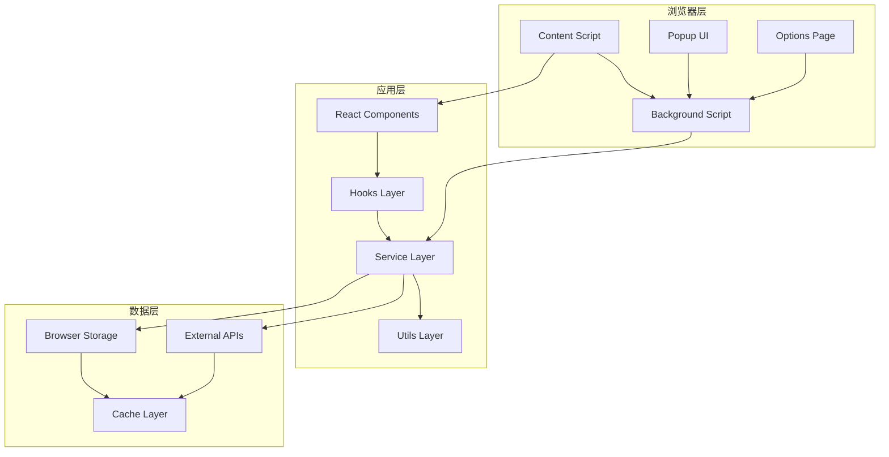
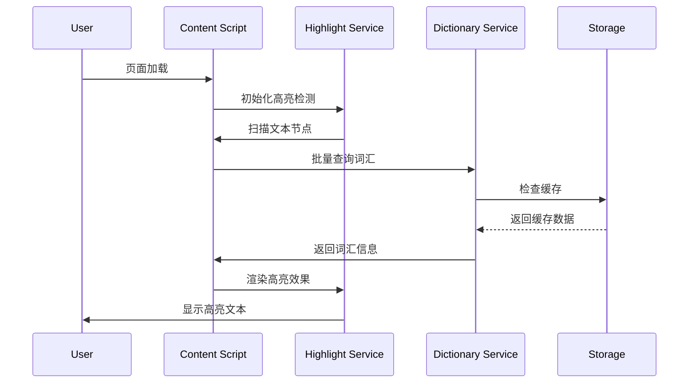
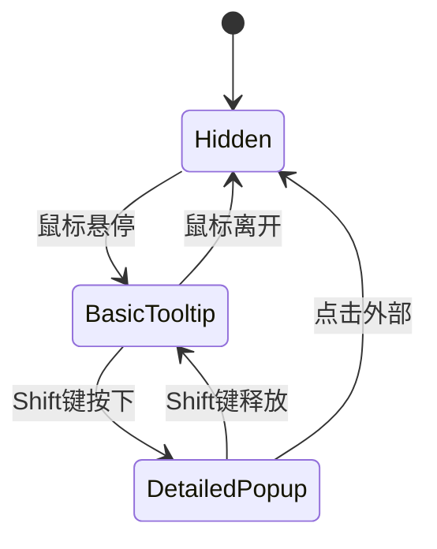

# 🏗️ F2_技术架构.md

## 📐 系统分层架构



## 🗂️ 核心模块设计

### 📱 UI组件架构
```
src/components/
├── tooltip/           # Tooltip系统
│   ├── BasicTooltip   # 基础悬停提示
│   ├── DetailedPopup  # 详细信息弹窗
│   └── TooltipManager # 状态管理
├── highlight/         # 高亮系统
│   ├── WordHighlight  # 词汇高亮
│   ├── GradientColor  # 渐变色彩
│   └── SelectionUI    # 选择界面
└── common/           # 通用组件
    ├── Button        # 按钮组件
    ├── Icon          # 图标组件
    └── Card          # 卡片组件
```

### 🔧 服务层架构
```
src/services/
├── dictionary/       # 词典服务
│   ├── api.ts       # API接口
│   ├── cache.ts     # 缓存管理
│   └── parser.ts    # 数据解析
├── highlight/       # 高亮服务
│   ├── detector.ts  # 文本检测
│   ├── renderer.ts  # 渲染引擎
│   └── manager.ts   # 状态管理
└── storage/         # 存储服务
    ├── local.ts     # 本地存储
    ├── sync.ts      # 同步存储
    └── cache.ts     # 缓存策略
```

## 💾 数据模型设计

### 词汇数据模型
```typescript
interface WordData {
  word: string;              // 原词
  syllables: string[];       // 音节分割
  phonetic: string[];        // 音标 (可多个)
  definitions: Definition[]; // 定义列表
  examples: Example[];       // 例句
  frequency: number;         // 使用频率
  lastAccessed: Date;        // 最后访问时间
}

interface Definition {
  partOfSpeech: string;     // 词性
  meaning: string;          // 含义
  short_chinese: string;    // 中文简释
  context: string[];        // 上下文标签
}
```

### 高亮状态模型
```typescript
interface HighlightState {
  selectedWords: Set<string>;    // 已选词汇
  gradientMap: Map<string, RGB>; // 颜色映射
  hoverZones: HoverZone[];       // 悬停区域
  tooltipState: TooltipState;    // Tooltip状态
}

interface TooltipState {
  isVisible: boolean;
  position: Position;
  content: WordData | null;
  stage: 'basic' | 'detailed';  // 两阶段状态
}
```

## 🗄️ 缓存策略

### 多级缓存架构
```
Level 1: 内存缓存 (Map/Set)
├── 词汇数据缓存 (最近1000个)
├── 渲染结果缓存 (DOM片段)
└── 计算结果缓存 (颜色/位置)

Level 2: 浏览器存储
├── chrome.storage.local (持久化数据)
├── chrome.storage.sync (用户设置)
└── IndexedDB (大量数据存储)

Level 3: 网络缓存
├── API响应缓存 (24小时)
├── 静态资源缓存 (永久)
└── 预加载缓存 (预测性)
```

### 缓存策略
- **LRU淘汰** - 最近最少使用优先淘汰
- **TTL过期** - 时间戳自动过期
- **容量限制** - 内存使用上限控制
- **智能预加载** - 基于用户行为预测

## 🔄 核心流程

### 词汇高亮流程


### Tooltip交互流程


## 🔌 API接口规范

### 内部API
```typescript
// 词典服务API
interface DictionaryAPI {
  lookup(word: string): Promise<WordData>;
  batchLookup(words: string[]): Promise<WordData[]>;
  getSuggestions(prefix: string): Promise<string[]>;
}

// 高亮服务API
interface HighlightAPI {
  highlightWord(word: string, element: Element): void;
  removeHighlight(word: string): void;
  updateGradient(words: string[]): void;
}

// 存储服务API
interface StorageAPI {
  get<T>(key: string): Promise<T | null>;
  set<T>(key: string, value: T): Promise<void>;
  remove(key: string): Promise<void>;
  clear(): Promise<void>;
}
```

## ⚡ 性能优化

### 渲染优化
- **虚拟滚动** - 大量内容分页渲染
- **防抖节流** - 高频事件优化
- **批量更新** - DOM操作合并
- **懒加载** - 按需加载组件

### 内存优化
- **对象池** - 重用对象实例
- **弱引用** - WeakMap/WeakSet使用
- **及时清理** - 事件监听器清理
- **内存监控** - 使用量实时监控

### 网络优化
- **请求合并** - 批量API调用
- **预加载** - 智能预测加载
- **压缩传输** - Gzip/Brotli压缩
- **CDN加速** - 静态资源分发

## 🔒 安全设计

### 数据安全
- **输入验证** - 严格参数校验
- **XSS防护** - 内容安全策略
- **CSRF防护** - 请求令牌验证
- **数据加密** - 敏感信息加密存储

### 权限控制
- **最小权限** - 按需申请权限
- **权限检查** - 运行时权限验证
- **安全边界** - 沙箱隔离执行
- **审计日志** - 操作记录追踪

---
*架构版本: v1.0 | 最后更新: 2024年12月*
